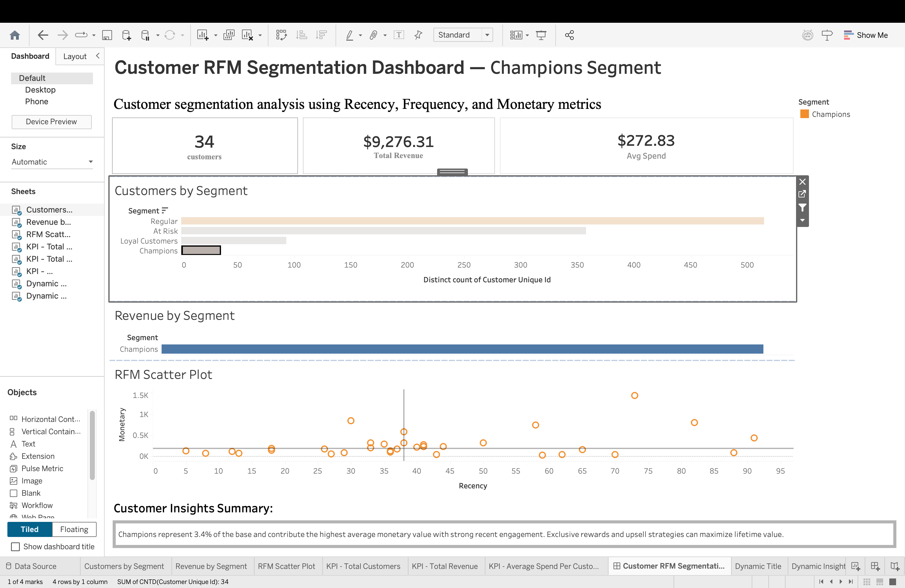
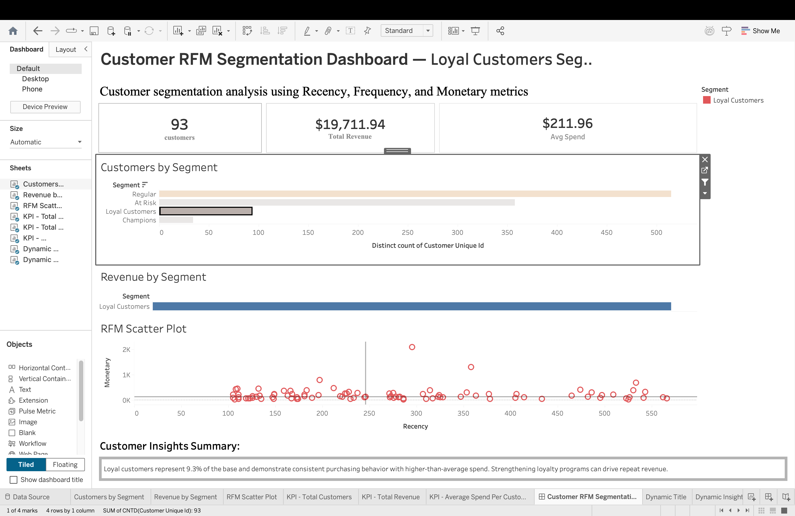
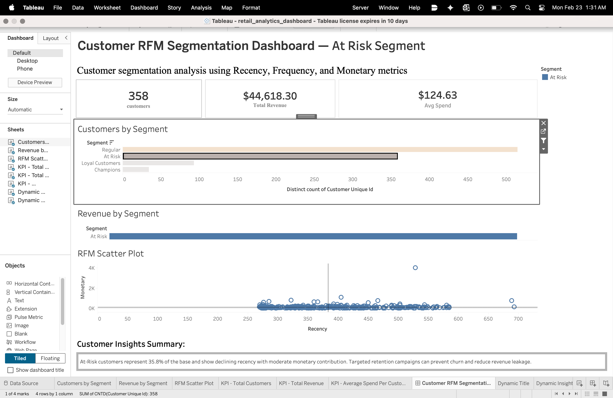
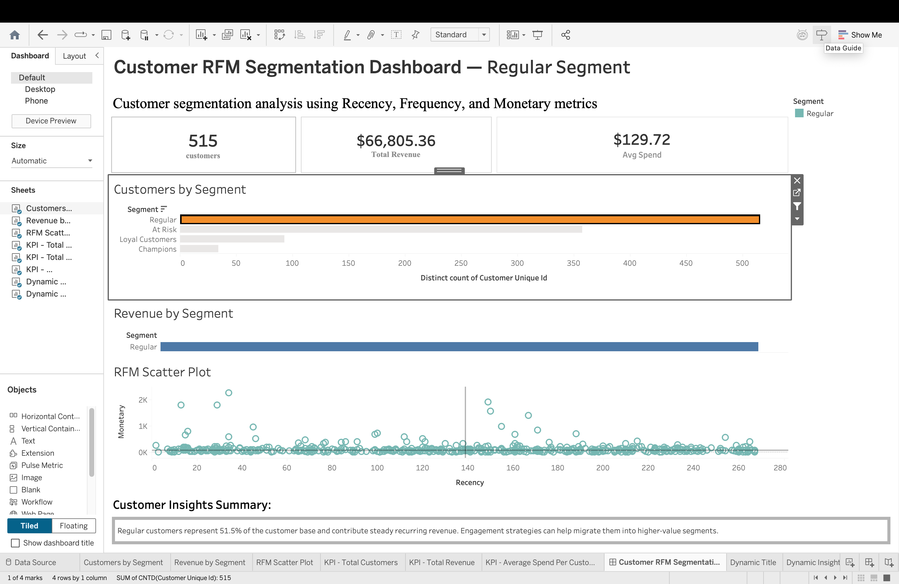

# Retail Analytics Platform – SQL | Python | Tableau

An end-to-end retail analytics solution designed to transform raw transactional data into actionable business insights using advanced SQL engineering, Python-based customer segmentation, and Tableau executive dashboards.

---

##  Project Overview

The workflow emphasizes data quality validation, scalable SQL design, and analytics mart construction to support BI reporting.

It demonstrates:

- Production-style SQL data modeling
- KPI engineering with reusable views
- Advanced SQL window functions
- Customer retention & cohort modeling
- Funnel conversion analysis
- Python-based RFM customer segmentation
- BI-ready analytics mart for dashboarding

---

##  Business Problems Solved

✔ Identify high-value and at-risk customers  
✔ Measure month-over-month revenue growth  
✔ Track customer lifetime value progression  
✔ Analyze retention trends by cohort  
✔ Monitor order-to-delivery funnel conversion  
✔ Deliver executive-ready KPI dashboard  

---
##  Architecture

Raw MySQL Tables  
→ Data Validation & Referential Integrity Checks  
→ KPI & Analytics Views  
→ Advanced SQL (Window Functions, Cohort, Funnel)  
→ Python RFM Segmentation  
→ Persist Segments to MySQL  
→ Customer Analytics Mart  
→ Tableau Executive Dashboard  

---

##  Technical Implementation

###  SQL Engineering (MySQL 8)

- Data validation & integrity checks
- Join explosion detection & grain control
- Reusable KPI views:
  - Average Order Value
  - Monthly Revenue
  - Executive Summary
- Advanced window functions:
  - `LAG()` → MoM revenue growth
  - `LEAD()` → Repeat purchase gap
  - `SUM() OVER()` → Customer lifetime value
- Cohort retention modeling
- Funnel conversion analysis
- Analytics mart design for BI tools

---

###  Python – RFM Customer Segmentation

Built using:

- Pandas
- SQLAlchemy
- Quantile scoring (1–5 scale)

RFM scoring logic:
- Recency → Days since last purchase
- Frequency → Total number of orders
- Monetary → Total customer spend

Customer Segments:
- Champions
- Loyal Customers
- Regular
- At Risk

Segments are automatically written back into MySQL, enabling downstream BI reporting and structured analytics mart integration.

---

###  Business Intelligence (Tableau)

Executive dashboard includes:

- Total Customers
- Total Revenue
- Average Spend
- Revenue by Segment
- Customer Distribution
- RFM Scatter Visualization

---

##  Tableau Dashboard – RFM Segmentation

###  Champions Segment

###  Loyal Customers

###  At Risk Customers

###  Regular Customers

---

##  Project Structure

retail-analytics-sql-python-tableau/
│
├── python/
│   └── rfm_analysis.py
│
├── sql/
│   ├── 00_database_setup.sql
│   ├── 01_data_validation.sql
│   ├── 02_relationship_checks.sql
│   ├── 03_kpi_views.sql
│   ├── 04_window_analysis.sql
│   ├── 05_cohort_analysis.sql
│   ├── 06_funnel_analysis.sql
│
├── tableau/
│   ├── champions.png
│   ├── loyal_customers.png
│   ├── at_risk.png
│   └── regular.png
│
├── README.md
└── .gitignore

---

##  Performance & Optimization

- Controlled join grain to prevent row explosion
- Used window functions for scalable time-based analytics
- Designed reusable KPI views to minimize query redundancy
- Structured analytics mart for BI tool efficiency

##  Tech Stack

- MySQL 8
- Advanced SQL (CTEs, Window Functions)
- Python 3
- Pandas
- SQLAlchemy
- Tableau

---

##  Key Outcomes

- Engineered reusable analytics views to support scalable KPI reporting
- Designed BI-ready customer analytics mart
- Implemented full RFM segmentation pipeline
- Applied production-style SQL engineering best practices
- Delivered executive-level performance dashboard

##  Business Insights Summary

- Champions represent 3.4% of customers but drive the highest average revenue.
- Loyal customers contribute consistent recurring revenue.
- At-risk customers show declining engagement — opportunity for targeted retention.
- Regular customers form the majority base and provide steady revenue flow.

